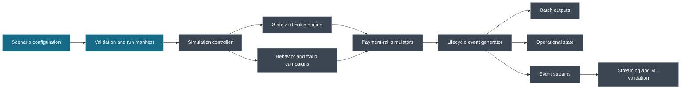

# FraudTwin

[](.github/workflows/ci.yml)
[](https://www.python.org/)
[](LICENSE)

## Build and test fraud systems against a financial world that behaves like one

FraudTwin is a synthetic financial-system simulator for fraud engineers, data
scientists, ML engineers, and data teams who need more than a collection of
random transaction rows.

Most fraud datasets describe a transaction after everything has happened. Real
financial systems are different. A payment begins, changes state, produces
multiple events, and may later become a dispute or a fraud case. Information
also arrives at different times, and the final label may not be available when
the original decision was made.

FraudTwin is being built to make those conditions realistic, configurable, and
reproducible.



The blue path is available today. The remaining components represent the
system FraudTwin is growing toward.

## What FraudTwin is about

- A stateful world of customers, accounts, cards, merchants, devices, and payments
- Card, PIX-like, and account-transfer lifecycles
- Event time that is separate from ingestion and processing time
- Fraud truth that is separate from what downstream systems can observe
- Delayed labels for historically correct ML datasets
- Reproducible scenarios controlled by configuration versions and seeds
- Failure modes such as duplicates, late events, outages, and schema changes
- A path from batch simulation to PostgreSQL, Kafka, Flink, graph, and ML workflows

The goal is simple: give professionals a safe environment in which to test the
systems around fraud detection—not just the classifier at the end of the pipe.

## Current status

Milestone 1 is complete. FraudTwin now creates deterministic synthetic
customers, institutions, accounts, cards, merchants, devices, and PIX-like
keys as typed Parquet tables with reproducible run manifests. Payment, fraud,
and streaming behavior remain on the roadmap.

Try the entity generator with:

```bash
poetry install
poetry run fraudtwin config validate configs/minimal.yaml
poetry run fraudtwin generate configs/minimal.yaml
```

The generated run contains one Parquet file per entity under
`runs/<run_id>/entities/`.

## Why this project exists

Fraud teams need data that reflects the messy parts of production:

- State changes over time
- Multiple payment rails and lifecycle events
- Labels that arrive after the transaction
- Late, duplicated, or out-of-order data
- Coordinated behavior across accounts, devices, and merchants
- Repeatable scenarios for model comparison and pipeline testing

FraudTwin brings these concerns into one coherent, synthetic environment while
keeping business rules and temporal correctness ahead of generative complexity.

## Related work

FraudTwin builds on a growing ecosystem of synthetic financial-data projects:

- [SantanderAI/gen-fraud-graph](https://github.com/SantanderAI/gen-fraud-graph) is focused on large transaction graphs, fraud-ring generation, and graph ML benchmarking.
- [afborda/synthfin-core](https://github.com/afborda/synthfin-core) provides broad synthetic banking, PIX, ride-share, batch, and streaming data workflows.

Those projects are valuable reference points. FraudTwin’s focus is the broader
system around a transaction: state, lifecycle semantics, observability delays,
data failures, replay, and point-in-time ML correctness.

## Documentation

- [`FEATURES.md`](FEATURES.md) — specification and roadmap
- [`CHANGELOG.md`](CHANGELOG.md) — release history
- [`DEVELOPMENT.md`](DEVELOPMENT.md) — contributor setup
- [`LICENSE`](LICENSE) — Apache License 2.0
